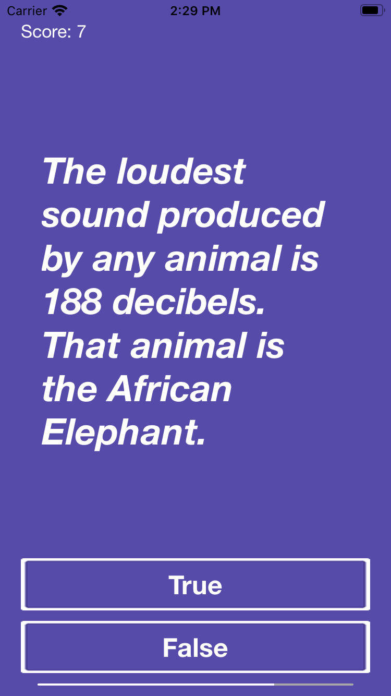

#  Quizzler
A True/False Quiz Game.

## Technologies
- <a href="https://developer.apple.com/documentation/foundation/timer"> Timer </a> - A timer that fires after a certain time interval has elapsed, sending a specified message to a target object.

## Screenshot

## Credits
- <a href="https://developer.apple.com/documentation"> Apple Developer Documentation </a>
- <a href="https://www.udemy.com/course/ios-13-app-development-bootcamp/"> iOS Application Development Bootcamp </a> by Dr. Angela Yu.
